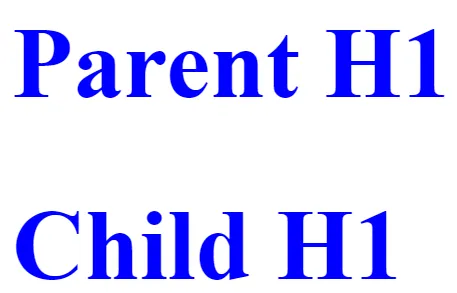

== CSS樣式 (Style)
在Angular中的樣式是用來為特定的元件設計樣式

=== ::ng-deep
忽略元件的層級關係，強制修改所有的css樣式。

.範例
[source, typescript]
----
// 父組件
import { Component, ViewEncapsulation } from '@angular/core';

@Component({
  selector: 'app-style-example',
  template: `
  <h1>Parent H1</h1>
  <app-style-example-child></app-style-example-child>
`,
  styles: [`
    `]
})
export class StyleExampleComponent {}

// 子組件
import { Component } from '@angular/core';

@Component({
  selector: 'app-style-example-child',
  template: '<h1>Child H1</h1>',
  styles: [`
     ::ng-deep h1{
      color:blue;
    }
  `]
})
export class StyleExampleChildComponent {}
----

.使用ng-deep

NOTE: 此方法已被棄用，保留在API內僅是為了向後兼容，不應該再繼續使用。

=== :host  

:host是css裡的偽類，用來選擇元件的宿主元素(也就是index.html當中的<app-root>)，並且對這個宿主元素進行樣式設置。

簡單範例:

.app.component.css
[source,css]
----
:host {
    display: block;
    margin: 10px;
    padding: 20px;
    background-color: lightblue;
}
----

.app.component.ts
[source, typescript]
----
@Component({
  selector: 'app-root', //
  standalone: true,
  imports: [RouterOutlet, RouterModule, RouterLink, HomeComponent, NgIf, NgStyle],
  templateUrl: './app.component.html',
  styleUrl: './app.component.css'
})
export class AppComponent {
}

----

.index.html
[source,html]
----
<body>
    <app-root></app-root>
</body>
----

我們定義了selector屬性為app-root，上述的<app-root>標籤就會套用到:host的樣式

=== :host-context

:host-context 選擇器用來根據元件的外部上下文環境來設置樣式，當元件的祖先元素(或父元素)滿足特定條件時，該選擇器可以應用樣式到元件本身或其內部元素

簡單範例:

當使用者選擇了黑暗模式，所有的元件都應該要改成黑色背景白色文字 

.child.component.css
[source,css]
----
:host-context(.dark-theme) {
    background-color: black;
    color: white;
}
----

.某個引用app-child的元件
[source,html]
----

    <app-child></app-child>

----

:host-context(.dark-theme) 會檢查 app-child 的父級元素或祖先元素是否有 .dark-theme 類，如果有則會應用這些樣式，將 app-child 的背景設置為黑色，文字顏色設置為白色

link:./Component_Structure.html[回上一頁]