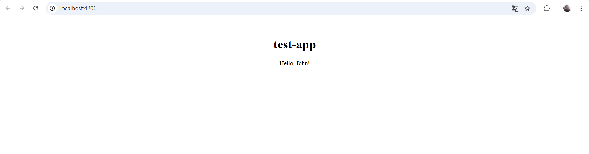
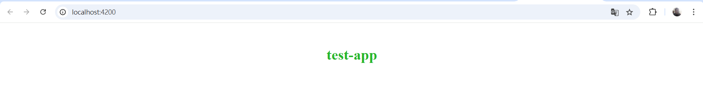
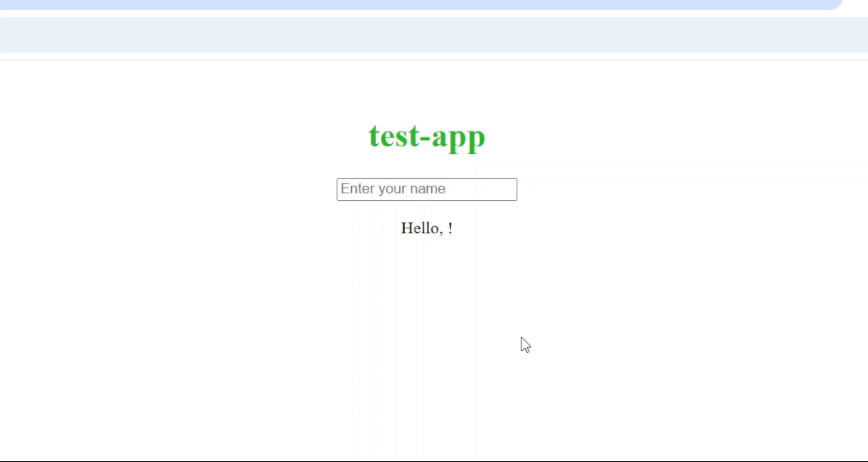
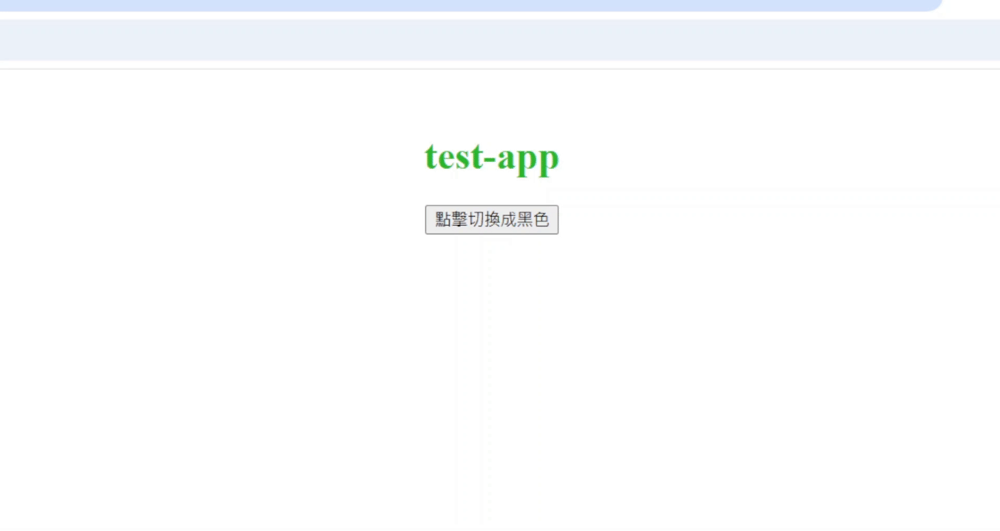

== HTML模板 (Template)
Angular 組件的模板文件，負責定義類別組件的視圖結構，透過 Angular 的模板語法實現資料的顯示、條件渲染、事件處理等功能，並動態更新畫面，與 app.component.ts 當中的邏輯緊密結合，實現互動式的使用者界面。

== HTML模板常用的語法

=== Interpolation
用來顯示組件類中的資料，在HTML模板使用{{}}即可取得屬性值

*app.component.ts*

[source,javascript]
----
import { Component } from '@angular/core';

@Component({
    selector: 'app-root',
    standalone: true,
    templateUrl: './app.component.html',
    styleUrl: './app.component.css'
})

export class AppComponent {
    title = 'test-app';
    userName = 'John';
}
----

*app.component.html*
[source,html]
----
<h1>{{ title }}</h1>  <!--  test-app   -->

Hello, {{ userName }}!
  <!--  Hello, John   -->
----

=== Property Binding in Angular

使用屬性繫結可以動態更新 HTML 元素的屬性。
他會將你用 "[]" 包起來的屬性的值與元件內同名稱的值做綁定

*app.component.ts*
[source,javascript]
----
import { Component } from '@angular/core';

@Component({
    selector: 'app-root',
    standalone: true,
    templateUrl: './app.component.html',
    styleUrl: './app.component.css'
})

export class AppComponent {
    title = 'test-app';
    color = "color: #26b72a";
}

----

*app.component.html*
[source,html]
----
<h1 [style]="color">{{ title }}</h1>
----

Note:如果沒有"[]"包起來無法綁定，且[]內需要為該元素的屬性，否則需要加上attr.

=== Two-way binding
雙向綁定是一種同時做綁定值到元素上也可以對這個元素值進行修改 +

- [] => 綁定元素值

- ()=> 綁定事件

- [()] => 為雙向綁定

父樣板和組件
*app.component.ts*
[source,javascript]
----
import { Component } from '@angular/core';
import { FormsModule } from '@angular/forms'; // 需要import FormsModule

@Component({
    selector: 'app-root',
    standalone: true,
    imports: [FormsModule],
    templateUrl: './app.component.html',
    styleUrl: './app.component.css'
})

export class AppComponent {
    title = 'test-app';
    color = "color: #26b72a";

    userName = '';
}
----

*app.component.html*
[source,html]
----
<h1 [style]="color">{{ title }}</h1>
<input [(ngModel)]="userName" placeholder="Enter your name">

Hello, {{ userName }}!

----
上述程式當使用者在輸入框輸入內容時，網頁同時會動態更新 userName 屬性

=== Event handling

Angular 處理事件時，會將事件與組件實例綁定，與傳統 JavaScript 的事件處理不同。
this會指向該元件

*app.component.ts*
[source,javascript]
----
import { Component } from '@angular/core';

@Component({
    selector: 'app-root',
    standalone: true,
    templateUrl: './app.component.html',
    styleUrl: './app.component.css'
})

export class AppComponent {
    title = 'test-app';
    color = "color: #26b72a";

    onClick(e:any) {
        this.color = "color: #000000";
        console.log(e)
    }
}
----

*app.component.html*
[source,html]
----
<h1 [style]="color">{{ title }}</h1>
<button (click)="onClick(this)">點擊切換成黑色</button>
----
[quote]
____
Note:可以使用$event，傳入事件
____

=== Change Detection

Change Detection 在以下情況下觸發：

1. 事件觸發。
2. 非同步操作完成。
3. 手動觸發 `ChangeDetectorRef.detectChanges()`。

==== Component Communication

Angular 提供了 `@Input` 和 `@Output` 來處理元件之間的通訊。

==== @Input

[source,javascript]
----
@Component({
    selector: 'app-user',
    template: `
        
The user's occupation is {{ occupation }}

    `
})
export class UserComponent {
    @Input() occupation = '';
}
----

==== @Output
1.傳入事件

使用@Output建立父與子組件的溝通，並且把值assign給EventEmitter，
父層
[source,html]
----
//樣板

my name is {{myName}} 

<app-child (updateNameFun)="updateName($event)"></app-child>
//組件
updateName(inputName:string){
    this.myName = inputName;
}
----

子層
[source,javascript]
----
@Component({
    selector: 'app-child',
    styles: `.btn { padding: 5px; }`,
    template: `<input type="text" (change)="addItem($event)" />`,
    standalone: true,
})
export class ChildComponent {
    @Output() updateNameFun = new EventEmitter<string>();//在angular中，this會幫指向組件，必須用$event才能指向觸發事件
    //當這個input觸發change事件後執行addItem並把觸發事件當作參數傳入，最後透過EventEmitter將事件發送回去再附加傳入值
    addItem(e:any) {
        this.updateNameFun.emit(e.target.value); 
    }
}
----

link:index.html[回首頁]
