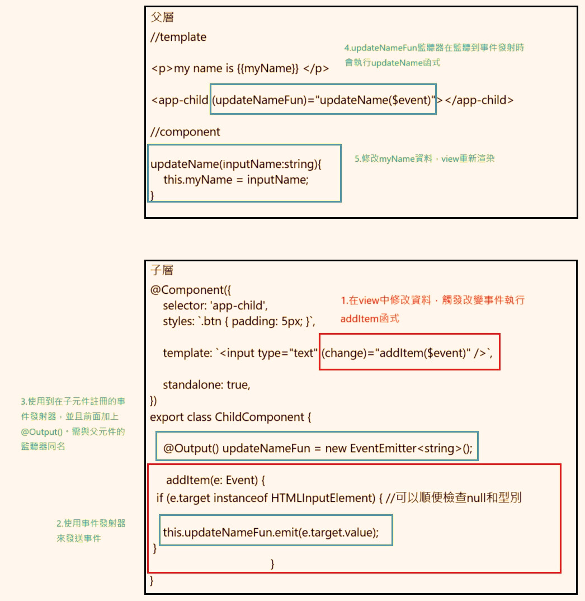

== HTML模板 (Template)
Template 負責定義元件的 View ，也就是畫面的呈現方式。 +
開發者能透過 Angular 的模板語法來實現資料的顯示、條件渲染、事件處理等功能，並**動態**的更新畫面。

== HTML模板常用的語法

=== Interpolation
用來將Class中的資料呈現在Template上的語法，在HTML模板使用 `{{ }}` 即可取得值。

.app.component.ts
[source,javascript]
----
import { Component } from '@angular/core';

@Component({
    selector: 'app-root',
    standalone: true,
    templateUrl: './app.component.html',
    styleUrl: './app.component.css'
})

export class AppComponent {
    title = 'test-app'; // <-預先在Class中定義好的值
    userName = 'John';
}
----

.app.component.html
[source,html]
----
<h1>{{ title }}</h1>  <!--  test-app   -->

Hello, {{ userName }}!
  <!--  Hello, John   -->
----

.顯示畫面
image:../image/html_ex1.png[html_ex1]

=== 資料綁定

Angular定義了四種資料綁定的方式，其中前面所講的 `{{ }}` 語法便是其中一項。 + 

下圖分別表示了不同的資料綁定的形式、元件和DOM的溝通方向。

.資料綁定的四種類型
image::../image/databinding.png[四種資料綁定]

==== 屬性綁定

屬性綁定是將元件內的資料動態的設定到 HTML 元素或是指令的屬性值上。 

使用方式: 使用 `[]` 包裹 HTML 元素的屬性，並使用 `=` 賦值。

背後原理: Angular 會將 Template 內 `[]` 括號內的屬性名稱，對應到**元件中同名稱**的屬性或變數。如果元件中沒有對應的屬性，則屬性綁定將不起作用。

.app.component.ts
[source,javascript]
----
import { Component } from '@angular/core';

@Component({
    selector: 'app-root',
    standalone: true,
    templateUrl: './app.component.html',
    styleUrl: './app.component.css'
})

export class AppComponent {
    title = 'test-app';
    color = "color: #26b72a"; // <-欲要綁定到Style上的值
}

----

.app.component.html
[source,html]
----
<h1 [style]="color">{{ title }}</h1>
----
image:../image/html_ex2.png[html_ex2]

NOTE: 1. 綁定的目標屬性必須是 HTML 元素所支持的標準屬性，並且沒有使用 `[]` 包覆是無法綁定的。 + 
2. 若屬性為 自定義屬性 或 未知屬性的話需要加上attr.

==== 事件綁定

Angular 的事件處理，會在編譯模板時會自動將事件處理方法透過 `bind()` 方法綁定到元件實例上。並且this會指向該元件。

使用方式: 使用 `()` 包裹並宣告要監聽的事件，並使用 `=` 來告訴 Angular 事件發生時要執行的元件方法。

NOTE: 事件物件：可以使用 **$event** 來傳入事件，並在函式中使用Event型別來接收事件來獲取更多的訊息與操作，例如事件類型、目標元素、阻止默認行為等。

.app.component.html
[source,html]
----
<h1 [style]="color">{{ title }}</h1>
<button (click)="onClick($event)">點擊切換成黑色</button>
----

.app.component.ts
[source,javascript]
----
import { Component } from '@angular/core';

@Component({
    selector: 'app-root',
    standalone: true,
    templateUrl: './app.component.html',
    styleUrl: './app.component.css'
})

export class AppComponent {
    title = 'test-app';
    color = "color: #26b72a";

    onClick(e:Event) {
        this.color = "color: #000000";
        e.preventDefault(); // 阻止預設事件
        console.log(e) //輸出事件物件到console上顯示
    }
}
----

.畫面展示
image:../image/html_ex3.gif[html_ex3]

==== Two-way binding
雙向綁定是一種同時做綁定值到元素上也可以對這個元素值進行修改 +

- [] => 綁定元素值

- ()=> 事件綁定

- [()] => 為雙向綁定

父模板和組件
.app.component.ts
[source,javascript]
----
import { Component } from '@angular/core';
import { FormsModule } from '@angular/forms'; // 需要import FormsModule

@Component({
    selector: 'app-root',
    standalone: true,
    imports: [FormsModule],
    templateUrl: './app.component.html',
    styleUrl: './app.component.css'
})

export class AppComponent {
    title = 'test-app';
    color = "color: #26b72a";

    userName = '';
}
----
=== Change Detection

Change Detection 在以下情況下觸發：

1. 事件觸發。
2. 非同步操作完成。
3. 手動觸發 `ChangeDetectorRef.detectChanges()`。

==== Component Communication

Angular 提供了 `@Input` 和 `@Output` 來處理元件之間的通訊。

=== @Input

[source,javascript]
----
//父模板
    <app-user name="Simran" />
//子元件
@Component({
    selector: 'app-user',
    template: `
        
The user's name is {{ name }}

    `,
    standalone: true,
})
export class UserComponent {
    @Input() name = '';
}
----

==== @Output
1.傳入事件

使用@Output建立父元件與子元件的溝通

link:Component_Structure.html[回上一頁]
