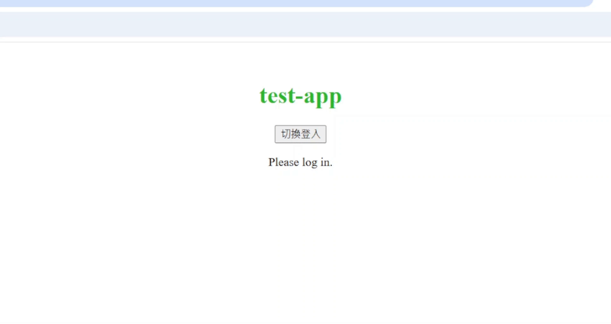
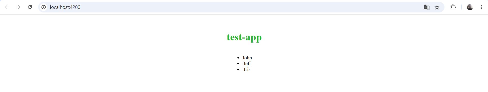

== HTML模板 (Template)
Angular 組件的模板文件，負責定義類別組件的視圖結構，透過 Angular 的模板語法實現資料的顯示、條件渲染、事件處理等功能，並動態更新畫面，與 app.component.ts 當中的邏輯緊密結合，實現互動式的使用者界面。

=== HTML模板常用的語法

* **插值表達式 {{}}:** 用來顯示組件類中的資料
+
*app.component.ts*
+
[source,typescript]
----
import { Component } from '@angular/core';

@Component({
    selector: 'app-root',
    standalone: true,
    templateUrl: './app.component.html',
    styleUrl: './app.component.css'
})

export class AppComponent {
    title = 'test-app';
    userName = 'John';
}
----
+
*app.component.html*
+
[source,html]
----
<h1>{{ title }}</h1>  <!--  test-app   -->

Hello, {{ userName }}!
  <!--  Hello, John   -->
----
+
image:../image/html_ex1.png[html_ex1]

* **屬性綁定:** [property]="componentAttribute"
+
將組件中的資料綁定到HTML元素的屬性上，讓屬性值可以動態更新
+
*app.component.ts*
+
[source,typescript]
----
import { Component } from '@angular/core';

@Component({
    selector: 'app-root',
    standalone: true,
    templateUrl: './app.component.html',
    styleUrl: './app.component.css'
})

export class AppComponent {
    title = 'test-app';
    color = "color: #26b72a";
}
----
+
*app.component.html*
+
[source,html]
----
<h1 [style]="color">{{ title }}</h1>
----
+
image:../image/html_ex2.png[html_ex2]

* **事件綁定:**
+
當操作者觸發某個事件（點擊、鍵盤事件）時，綁定的函數會被調用

*app.component.ts*
[source,typescript]
----
import { Component } from '@angular/core';

@Component({
    selector: 'app-root',
    standalone: true,
    templateUrl: './app.component.html',
    styleUrl: './app.component.css'
})

export class AppComponent {
    title = 'test-app';
    color = "color: #26b72a";

    onClick() {
        this.color = "color: #000000";
    }
}
----

*app.component.html*
[source,html]
----
<h1 [style]="color">{{ title }}</h1>
<button (click)="onClick()">點擊切換成黑色</button>
----

image:../image/html_ex3.gif[html_ex3]

* **雙向資料綁定:** [(ngModel)]="property"
+
雙向資料綁定允許模型與視圖之間的資料同步。當模型變更時，視圖自動更新，當使用者在視圖中修改時，模型也會自動變更

*app.component.ts*
[source,typescript]
----
import { Component } from '@angular/core';
import { FormsModule } from '@angular/forms'; // 需要import FormsModule

@Component({
    selector: 'app-root',
    standalone: true,
    imports: [FormsModule],
    templateUrl: './app.component.html',
    styleUrl: './app.component.css'
})

export class AppComponent {
    title = 'test-app';
    color = "color: #26b72a";

    userName = '';
}
----

*app.component.html*

[source,html]
----
<h1 [style]="color">{{ title }}</h1>
<input [(ngModel)]="userName" placeholder="Enter your name">

Hello, {{ userName }}!

----

上述程式當使用者在輸入框輸入內容時，網頁同時會動態更新userName屬性

image:../image/html_ex4.gif[html_ex4]

* **條件渲染:** *ngIf

根據條件來顯示或隱藏 HTML 元素

*app.component.ts*
[source,typescript]
----
import { Component } from '@angular/core';
import { CommonModule } from '@angular/common'; // 需要import CommonModule

@Component({
    selector: 'app-root',
    standalone: true,
    imports: [CommonModule],
    templateUrl: './app.component.html',
    styleUrl: './app.component.css'
})

export class AppComponent {
    title = 'test-app';
    color = "color: #26b72a";

    isLoggedIn = false;
    userName = 'John';

    onClick() {
        if (this.isLoggedIn) {
            this.isLoggedIn = false
        } else {
            this.isLoggedIn = true
        }
    }
}
----

*app.component.html*

[source,html]
----
<h1 [style]="color">{{ title }}</h1>
<button (click)="onClick()">切換登入</button>

Welcome back, {{ userName }}!

Please log in.

----

或是使用 *@if* 語法也可實現條件渲染(Angular 17)

*app.component.html*

[source,typescript]
----
<h1 [style]="color">{{ title }}</h1>
<button (click)="onClick()">切換登入</button>

@if (isLoggedIn) {
    
Welcome back, {{ userName }}!

}

@if (!isLoggedIn) {
    
Please log in.

}
----

[quote]
____
使用@if語法不需要匯入`CommonModule`
____

* **迭代渲染:** *ngFor

用來來迭代一個陣列，並渲染每個項目

*app.component.ts*

[source,typescript]
----
import { Component } from '@angular/core';
import { CommonModule } from '@angular/common'; // 需要import CommonModule

@Component({
    selector: 'app-root',
    standalone: true,
    imports: [CommonModule],
    templateUrl: './app.component.html',
    styleUrl: './app.component.css'
})

export class AppComponent {
    title = 'test-app';
    color = "color: #26b72a";

    persons = ['John', 'Jeff', 'Iris'];
}
----

*app.component.html*

[source,html]
----
<h1 [style]="color">{{ title }}</h1>
<ul>
  <li *ngFor="let person of persons">{{ person }}</li>
</ul>
----

或是使用 *@for* 語法也可實現條件渲染
[source,html]
----
<h1 [style]="color">{{ title }}</h1>
<ul>
    @for (person of persons; track person) {
        <li>{{ person }}</li>
    }
</ul>
----

[quote]
____
使用@for語法不需要匯入`CommonModule`
____

