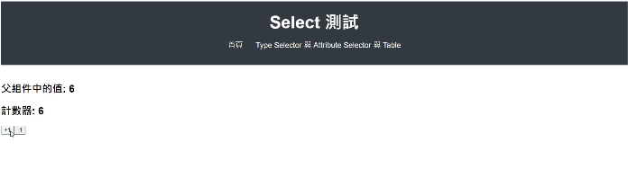

== HTML模板 (Template)
Template 負責定義元件的 View ，也就是**畫面**的呈現方式。 +
開發者能透過 Angular 的模板語法來實現資料的顯示、條件渲染、事件處理等功能，並**動態**的更新畫面。

== HTML模板常用的語法

=== Interpolation
用來將Class中的資料呈現在Template上的語法，在HTML模板使用 `{{ }}` 即可取得值。

.app.component.ts
[source,javascript]
----
import { Component } from '@angular/core';

@Component({
    selector: 'app-root',
    standalone: true,
    templateUrl: './app.component.html',
    styleUrl: './app.component.css'
})

export class AppComponent {
    title = 'test-app'; // <-預先在Class中定義好的值
    userName = 'John';
}
----

.app.component.html
[source,html]
----
<h1>{{ title }}</h1>  <!--  test-app   -->

Hello, {{ userName }}!
  <!--  Hello, John   -->
----

=== 資料綁定

Angular定義了四種資料綁定的方式，其中前面所講的 `{{ }}` 語法便是其中一項。 + 

下圖分別表示了不同的資料綁定的形式、元件和DOM的溝通方向。

.資料綁定的四種類型
image::../image/databinding.png[四種資料綁定]

==== 屬性綁定

屬性綁定是將元件內的資料動態的設定到 HTML 元素或是指令的屬性值上。 

使用方式: 使用 `[]` 包裹 HTML 元素的屬性，並使用 `=` 賦值，例如 `[property]="value"` ，將元件資料綁定到指定屬性。

背後原理: Angular 會將 Template 內 `[]` 括號內的屬性名稱，對應到**元件中同名稱**的屬性或變數。如果元件中沒有對應的屬性，則該屬性綁定將不起作用。

NOTE: 1. 綁定的目標屬性必須是 HTML 元素所支持的標準屬性，並且沒有使用 `[]` 包覆是無法綁定的。 + 
2. 若屬性為 自定義屬性 或 未知屬性的話需要加上attr.

.app.component.ts
[source,javascript]
----
import { Component } from '@angular/core';

@Component({
    selector: 'app-root',
    standalone: true,
    templateUrl: './app.component.html',
    styleUrl: './app.component.css'
})

export class AppComponent {
    title = 'test-app';
    color = "color: #26b72a"; // <-欲要綁定到Style上的值
}

----

.app.component.html
[source,html]
----
<h1 [style]="color">{{ title }}</h1>
----

image:../image/html_ex2.png[html_ex2]

==== 事件綁定

在 Angular 中，事件綁定允許將模板中的事件直接綁定到元件的特定方法上。 

事件處理機制: 在編譯模板時， Angular 會自動將事件處理方法綁定到元件實例，並且在執行時 this 會指向該元件。

使用方式: 使用 `()` 包裹事件名稱，並宣告要監聽的事件，例如 `(click)="methodName()"` 。

NOTE: 事件物件: 可以使用 **$event** 來傳入事件，並在函式中使用Event型別來接收事件來獲取更多的訊息與操作，例如事件類型、目標元素、阻止默認行為等。

.app.component.html
[source,html]
----
<h1 [style]="color">{{ title }}</h1>
<button (click)="onClick($event)">點擊切換成黑色</button>
----

.app.component.ts
[source,javascript]
----
import { Component } from '@angular/core';

@Component({
    selector: 'app-root',
    standalone: true,
    templateUrl: './app.component.html',
    styleUrl: './app.component.css'
})

export class AppComponent {
    title = 'test-app';
    color = "color: #26b72a";

    onClick(e:Event) {
        this.color = "color: #000000";
        e.preventDefault(); // 阻止預設事件
        console.log(e) //輸出事件物件到console上顯示
    }
}
----

.畫面展示
image:../image/html_ex3.gif[html_ex3]

==== 雙向綁定(Two-way binding)
雙向綁定指的是畫面與元件的一種同步關係。這種同步是雙向的，也就意味著:

- 元件內的資料改變，畫面上的資料更新: 當元件中的資料改變時，對應的畫面元素會自動更新以呈現最新的資料。
- 畫面上的資料改變，元件內的資料更新: 當使用者修改畫面上的資料時，對應的元件資料會自動更新。

語法:

- [] => 用於將元件中的資料綁定到模板中的 HTML 屬性上。

- ()=> 用於將模板中的事件綁定到元件中的方法上。

- [()] => 將屬性綁定和事件綁定結合起來，實現雙向綁定。

實現方式:

- ngModel:  ngModel 是 Angular 提供的雙向綁定指令，它會建立一個 FormControl 來管理綁定的值。
- 髒值檢查:  Angular 會定期檢查所有綁定的屬性，一旦發現有變化，就會觸發重新渲染。
- 事件監聽:  Angular 會在綁定的元素上添加事件監聽器，當使用者與元素互動時，就會觸發事件，並更新對應的元件資料。

.app.component.ts
[source,javascript]
----
import { Component } from '@angular/core';
import { FormsModule } from '@angular/forms'; // 需要import FormsModule

@Component({
    selector: 'app-root',
    standalone: true,
    imports: [FormsModule],
    templateUrl: './app.component.html',
    styleUrl: './app.component.css'
})

export class AppComponent {
    title = 'test-app';
    color = "color: #26b72a";

    userName = '';
}
----
.app.component.html
[source,html]
----
<h1 [style]="color">{{ title }}</h1>
<input [(ngModel)]="userName" placeholder="Enter your name">

Hello, {{ userName }}!

----

上述程式當使用者在輸入框輸入內容時，網頁同時會動態更新 userName 屬性

image:../image/html_ex4.gif[html_ex4]

NOTE: ngModel 是 Angular 中最常用的雙向綁定指令，但它並不是唯一建立雙向綁定的方式。可以使用 `@Input()` 和 `@Output()` 這兩種裝飾器來定義雙向綁定的輸入和輸出值。並在模板上使用雙向綁定語法來實現雙向綁定。

===== 使用@Output與@Input建立雙向綁定

父Component

.data-binding.component.ts
[source,typescript]
----
import {Component} from '@angular/core';
import {ChildComponent} from './child/child.component';

@Component({
  selector: 'app-data-binding',
  standalone: true,
  imports: [
    ChildComponent // <- 引用子Component
  ],
  templateUrl: './data-binding.component.html',
  styleUrl: './data-binding.component.css'
})
export class DataBindingComponent {
  parentCount: number = 0;
}
----

.data-binding.component.html
[source, html]
----
<h1>父組件中的值: {{ parentCount }}</h1>

<!-- 使用 [(count)]="parentCount" 實現雙向綁定 -->
<app-child [(count)]="parentCount"></app-child>
----

子Component

.child.component.ts
[source, typescript]
----
import {Component, EventEmitter, Input, Output} from '@angular/core';

@Component({
  selector: 'app-child',
  standalone: true,
  imports: [],
  templateUrl: './child.component.html',
  styleUrl: './child.component.css'
})
export class ChildComponent {
  // 使用 @Input 接收外部傳入的值
  @Input() count: number = 0;

  // 使用 @Output 發送事件通知父組件值已更改
  // 命名規則: [properties名稱]Change
  @Output() countChange = new EventEmitter<number>();

  increment() {
    this.count++;
    // 發出更新事件
    this.countChange.emit(this.count);
  }

  decrement() {
    this.count--;
    // 發出更新事件
    this.countChange.emit(this.count);
  }
}
----

.child.component.html
[source, html]
----
<h2>計數器: {{ count }}</h2>
<button (click)="increment()">+1</button>
<button (click)="decrement()">-1</button>
----

.使用@Output與@Input綁定

=== Change Detection

Change Detection 在以下情況下觸發: 

1. 事件觸發。
2. 非同步操作完成。
3. 手動觸發 `ChangeDetectorRef.detectChanges()`。

==== Component Communication

Angular 提供了 `@Input` 和 `@Output` 來處理元件之間的通訊。

=== @Input

[source,javascript]
----
//父模板
    <app-user name="Simran" />
//子元件
@Component({
    selector: 'app-user',
    template: `
        
The user's name is {{ name }}

    `,
    standalone: true,
})
export class UserComponent {
    @Input() name = '';
}
----

==== @Output
1.傳入事件

使用@Output建立父元件與子元件的溝通

image::../image/output.jpg["圖片"]

=== 補充:
link:Controlflow.html[控制流]

link:Component_Structure.html[回上一頁]
