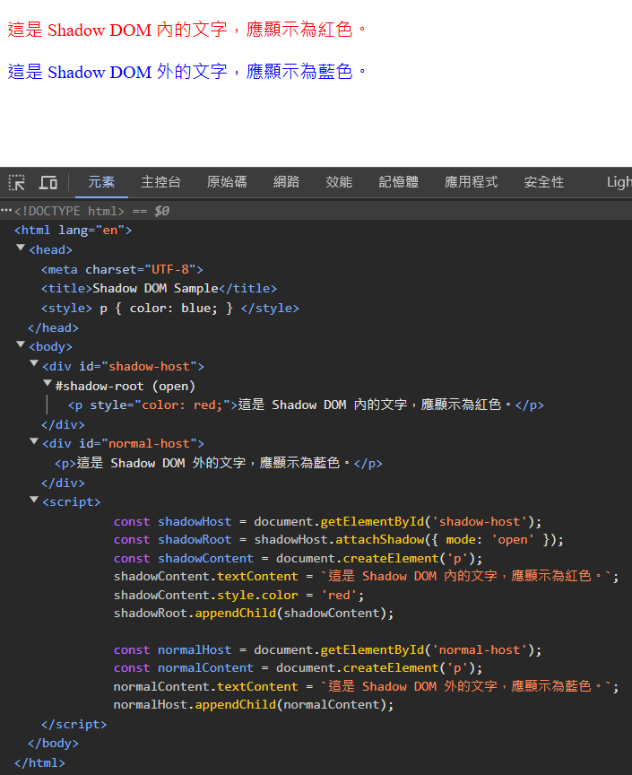

== Shadow DOM

簡單來說，**Shadow DOM** 是一種技術，它可以將 HTML 元素進行封裝和隔離，讓開發者能以自訂標籤的方式使用元件。

=== 什麼是 DOM?

**DOM** (Document Object Model) 是由 W3C 制定的一項標準，它獨立於平台和程式語言，提供了操作 HTML 文件內容、結構與樣式的 API。只要遵守 DOM 規範，開發者可以在任何平台或語言中通過 DOM 操作網頁結構。

這意味著我們可以透過 JavaScript 輕鬆操控網頁內容。**`document` 物件** 是 DOM 樹的根節點，因此，當我們存取網頁的 HTML 結構時，操作始於 `document`，並利用它所提供的通用函式來進行操作。

**DOM** 代表的是「**文件物件模型**」。當瀏覽器載入網頁時，HTML 的標籤(如文字、圖片、屬性等)會被轉換成物件或節點，最終形成樹狀結構，即 **DOM Tree**，用來反映 HTML 的層次關係。

例如，以下是一個簡單的 HTML 結構：

[source,html]
----
<html>
    <head>
        <title>example</title>
    </head>
    <body>
        <h1>Hello World</h1>
    </body>
</html>
----

這段 HTML 對應的 DOM Tree 結構如下：

=== 什麼是 Shadow DOM?

在網頁開發中，HTML、CSS 和 JavaScript 是三大核心技術，但實際開發時，常會面臨一些問題，例如：

- **CSS 樣式污染**：外部的 CSS 樣式可能影響內部元件。
- **JavaScript 命名空間衝突**: JavaScript 的全域變數或函式可能與其他程式碼發生衝突。

為了解決這些問題，W3C 提出了 **Shadow DOM** 的概念，讓開發者能在網頁上建立一個隔離的節點樹，該節點樹不會被外部的 CSS 或 JavaScript 干擾。

例如，雖然 CSS 的 **`!important`** 可以強制應用樣式，但它可能導致整個頁面樣式選擇器失控，影響其他部分的設計，這是典型的 **樣式污染** 問題。

**無論前端還是後端開發，將程式模組化並封裝起來以避免相互干擾，是提升開發效率與維護性的重要關鍵。**

**Shadow DOM** 是 **Web Components**(網頁元件)三大標準之一，其他兩個標準為 **HTML Templates** 和 **Custom Elements**(註：**HTML Imports** 已過時，不再建議使用)。

**Web 元件的關鍵屬性** 是「**封裝**」，它允許開發者將標記結構(markup)、樣式(style)和行為(behavior)封裝起來，並與頁面上的其他程式碼獨立。這代表Web 元件具備以下優點：

- 不會影響頁面上的其他程式碼。
- 不會被外部程式碼干擾。
- 提升程式碼的可讀性與可維護性，並保持簡潔。

這種封裝性質，讓 **Web Components** 成為現代化網頁應用程式開發中的重要技術。

==== Shadow DOM 的特性

- **Isolated DOM (隔離性)**: Shadow DOM 是 DOM 中的 DOM，它擁有自己的 HTML 元素、CSS 樣式與 JavaScript 程式碼，與外部的 DOM 隔離。
- **Scoped CSS & Simplifies CSS (範圍限定的 CSS)**: Shadow DOM 中的 CSS 作用範圍僅限於它內部的節點樹，避免了外部的樣式影響，可以簡化選擇器，並避免 ID 或 Class 名稱的衝突。
- **Composition (組合性)**: 你可以為 Shadow DOM 設計基於標記的 API，使其更靈活且可重用。
- **Productivity (提升生產力)**: 開發者不需要考慮全域影響，只專注於 Shadow DOM 的功能，使程式開發更高效。

基於這些特性，開發者可以創建類似 `<input>`、`<video>` 或 `<audio>` 的自訂標籤 (**Custom Elements**)，並充分利用 Shadow DOM 進行封裝與隔離。

=== Shadow DOM 的專有名詞

在學習 Shadow DOM 時，有幾個專有名詞需要了解:

- **Shadow Host**: Shadow DOM 的宿主元素，即 Shadow DOM 的根節點。
- **Shadow Tree**: Shadow DOM 的節點樹，包含了 Shadow DOM 的所有節點。
- **Shadow Root**: Shadow DOM 的根節點，是 Shadow Tree 的根節點。
- **Shadow Boundary**: Shadow DOM 與外部 DOM 之間的邊界，用來區分 Shadow DOM 與外部 DOM。
- **Shadow Boundary API**：用來操作 Shadow DOM 的 API，包括 `attachShadow()`、`shadowRoot` 等。 (由**瀏覽器**提供)

=== 如何建立與使用 Shadow DOM?

我們可以使用 `Element.attachShadow()` 方法將 Shadow DOM tree 附加到指定的元素上，並返回其 Shadow root。呼叫該方法時，可以設定 `mode` 為 `open` 或 `closed`: 

[source,javascript]
----
let shadowRootOpen = element.attachShadow({mode: 'open'});
let shadowRootClosed = element.attachShadow({mode: 'closed'});
----

- 設定 `{mode: 'open'}` 代表我們可以用頁面的 JavaScript 存取此 Shadow DOM 並對其進行操作。
- 設定 `{mode: 'closed'}` 則不允許外部操控此 Shadow DOM。呼叫 `shadow.shadowRoot` 時會取得 `null`，例如對於 `<input type="range">` 的 shadowRoot。

建立 Shadow DOM 時，還有以下兩個限制：

. 無法對已經內建 Shadow DOM 的元素再附加 Shadow DOM，例如 `<input>`。
. 無法對沒有子節點的元素附加 Shadow DOM，例如 ``。

=== 簡單範例

[source,html]
----
<!DOCTYPE html>
<html lang="en">

<head>
    <meta charset="UTF-8">
    <title>Shadow DOM Sample</title>
    
</head>

<body>
    

    

    
</body>

</html>
----

呈現結果如下：

link:Class.html[回上一頁]