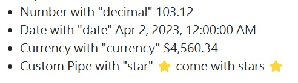

== 工具介紹

=== Forms

你可以使用 `ReactiveFormsModule` 或 `FormsModule` 來處理表單的資料繫結和驗證。

=== Reactive Forms

. 在 component 中定義這個表單擁有的屬性: 
+
[source,typescript]
----
export class UserComponent {
	profileForm = new FormGroup({
		name: new FormControl(''),
		email: new FormControl(''),
	});

	getUser(){
		console.log(this.profileForm);
	}
}
----

. 在 template 中: 
+
[source,html]
----

user page

my name is {{username}}

<form [formGroup]="profileForm">
	<label>
		Name
		<input type="text" formControlName="name" />
	</label>
	<label>
		Email
		<input type="email" formControlName="email" />
	</label>
	<button type="submit" (click)="getUser()">Submit</button>
</form>

<!-- 要提交表單，則在 form 標籤上加上 (ngSubmit)="handleSubmit()" -->
----

==== 資料流

1. 使用者在輸入欄位中輸入一個值
2. 表單輸入元素觸發一個 `input` 事件，並攜帶最新的值。
3. 監聽輸入事件的 `ControlValueAccessor` 會立即將新值傳遞給 `FormControl` 實例。
4. `FormControl` 實例透過 `valueChanges` 可觀察對象（Observable）發送新值。
5. 所有訂閱 `valueChanges` 的訂閱者接收到新的值。

=== Validators

. 在 component 中匯入 Validators:
+
[source,typescript]
----
import { ReactiveFormsModule, Validators } from '@angular/forms';
----

. 增加表單驗證:
+
[source,typescript]
----
profileForm = new FormGroup({
	name: new FormControl('', Validators.required), //第二個參數開始增加驗證方式
	email: new FormControl('', [Validators.required, Validators.email]),
});
----

. 在template 中使用表單驗證:
+
[source,html]
----
<button type="submit" [disabled]="!profileForm.valid">Submit</button>
----

=== Dependency Injection
Angular 可以在執行期間注入你要的 service 或 resource。

==== Creating an Injectable Service

在類別上標示 `@Injectable` 讓它可以被其他地方注入。

===== 參數
- `providedIn` -> (scope)

====== scope
- `root` : 整個應用程式
- `platform` :所有頁面上的應用程式共享一個特殊的單例平台注入器
- `any` : 在每個延遲加載的模組中提供一個唯一的實例，而所有提前加載的模組則共享一個實例。This option is DEPRECATED。
- `null` : 等同於 `undefined`，不會自動注入在任何地方，你必須加入在providers陣列裡面，在 `@NgModule` 或 `@Component`、 `@Directive`上

===== 範例

.Service

[source,typescript]
----
import { Injectable } from '@angular/core';

@Injectable({
  providedIn: 'root',  // 定義可以使用的範圍
})
export class CarService {
  cars = ['Sunflower GT', 'Flexus Sport', 'Sprout Mach One'];

  getCars(): string[] {
    return this.cars;
  }

  getCar(id: number) {
    return this.cars[id];
  }
}
----

.要注入資源的元件

[source,typescript]
----
import { Component, inject } from '@angular/core';
import { ChildComponent } from './child/child.component';
import { RouterOutlet, RouterLink } from '@angular/router';
import { ReactiveFormsModule } from '@angular/forms';
import { CarService } from './service/car.service';

@Component({
	selector: 'app-root',
	template: `
		<nav>
			<a routerLink="/">Home</a> |
			<a routerLink="/user">User</a>
			 
			{{ mycars }}
		</nav>  
    <router-outlet />
	`,
	standalone: true,
	imports: [ChildComponent, RouterOutlet, RouterLink],
})

export class AppComponent {
	mycars = '';
	
	constructor(private carService: CarService) {
		this.mycars = this.carService.getCars().join(' ⭐️ ');
	} // 建構子注入

	items = new Array();
	handlerAddItem(item: string) {
		this.items.push(item);
	}
}
----

=== Pipes

Pipes 是一個純函式，作用於 template (`{{}}`) 中，不會產生副作用。Angular 也提供一些內建的 pipe，下面是使用 Angular 提供的 pipe 和自定義 pipe 的範例。

自定義pipe
[source,typescript]
----
import {Pipe, PipeTransform} from '@angular/core';

@Pipe({
	standalone: true,
	name: 'star',
})
export class StarPipe implements PipeTransform {
	transform(value: string): string {
		return `⭐️ ${value} ⭐️`;
	}
}
----

使用pipe
[source,typescript]
----
import { Component, inject } from '@angular/core';
import { ChildComponent } from './child/child.component';
import { RouterOutlet, RouterLink } from '@angular/router';
import { ReactiveFormsModule } from '@angular/forms';
import { CarService } from './service/car.service';
import { DecimalPipe, DatePipe, CurrencyPipe } from '@angular/common'; //匯入
import { StarPipe } from './pipe/star.pipe';

@Component({
	selector: 'app-root',
	template: `
		<nav>
			<a routerLink="/">Home</a> |
			<a routerLink="/user">User</a>
			 
		</nav> 
		<ul>
			<li>Number with "decimal" {{ num | number : '3.2-2' }}</li>
			<li>Date with "date" {{ birthday | date : 'medium' }}</li>
			<li>Currency with "currency" {{ cost | currency }}</li>
			<li>Custom Pipe with "star" {{ wrappedstring | star }}</li>
		</ul> 
		<router-outlet />
	`,
	standalone: true,
	imports: [ChildComponent, RouterOutlet, RouterLink, DecimalPipe, DatePipe, CurrencyPipe, StarPipe],
})

export class AppComponent {
	num = 103.1234;
	birthday = new Date(2023, 3, 2);
	cost = 4560.34;
	wrappedstring = 'come with stars';
}
----

link:index.html[回首頁]
