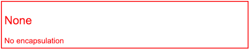
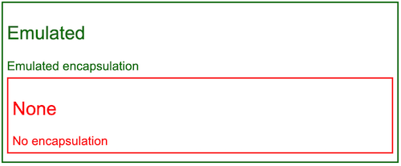

== Angular ViewEncapsulation

在 Angular 中，元件的樣式可以封裝在元件的宿主元素中，這樣它們就不會影響應用程式的其餘部分。

`Component` 的裝飾器提供了 `encapsulation` 選項，可用來控制每個元件如何應用檢視封裝。

=== ViewEncapsulation 模式

Angular 中的 `ViewEncapsulation` 主要有以下幾種模式: 

|===
| 模式 | 說明
| **Emulated** | Angular 會修改元件的 CSS 選擇器，使它們只應用於元件的View，不影響應用程式中的其他元素(模擬 Shadow DOM 行為)。
| **None** | Angular 不應用任何形式的View封裝，這意味著為元件指定的任何樣式實際上都是全域應用的，並且可以影響應用程式中存在的任何 HTML 元素。這種模式本質上與將樣式包含在 HTML 本身中是一樣的。
| **ShadowDom** | Angular 使用瀏覽器內建的 Shadow DOM API 將元件的View包含在 ShadowRoot(用作元件的宿主元素)中，並以隔離的方式應用所提供的樣式。
|===

[NOTE]
另外還有一種 **Native** 模式，但在最新版本的 Angular 中已經被移除。

=== 檢視生成的CSS

使用 `ViewEncapsulation.Emulated` 時，Angular會預先處理所有元件的樣式，以便它們僅應用於元件的View。

在正在執行的Angular應用程式中的DOM中，使用Emulated模式的元件的樣板看起來像這樣:

[source,html]
----
<hero-details _nghost-pmm-5>
    <h2 _ngcontent-pmm-5>Mister Fantastic</h2>
    <hero-team _ngcontent-pmm-5 _nghost-pmm-6>
        <h3 _ngcontent-pmm-6>Team</h3>
    </hero-team>
</hero-details>
----

會有兩種屬性 `_nghost` 和 `_ngcontent`，這些屬性是Angular用來標記元件的樣式。

|===
| 屬性 | 說明
| **_nghost** | 被新增到包裹元件View的元素，這就是原生 Shadow DOM 封裝中的 ShadowRoots。元件的宿主元素通常就是這種情況。
| **_ngcontent** | 被新增到元件View中的子元素上，這些屬性用於將元素與其各自模擬的 ShadowRoots(具有對應 `_nghost` 屬性的宿主元素)相對應。
|===

[NOTE]
Angular會自動生成這些Attribute Selector的Component附加到已有的HTML元素上，這樣就能透過這些屬性把樣式跟行為附加到元素上，你不需要手動添加它們。

它們以生成的元件樣式為目標，這些樣式會被注入到 DOM 的 `<head>` 部分:

[source,css]
----
[_nghost-pmm-5] {
    display: block;
    border: 1px solid black;
}
h3[_ngcontent-pmm-6] {
    background-color: white;
    border: 1px solid #777;
}
----

這些樣式經過後期處理，使每個 CSS 選擇器都使用適當的 `_nghost` 或 `_ngcontent` 屬性進行擴充。這些修改後的選擇器可以確保樣式以隔離和有針對性的方式應用於元件的檢視。

=== 混合封裝樣式

你可以在元件的裝飾器中針對每個元件使用不同的封裝模式。

儘管可以這樣做，但不建議這樣做，因為會導致全域樣式跟元件樣式之間的混亂。

如果真的需要，你應該要清楚了解使用不同封裝模式的元件樣式之間會如何互動:

|===
| 模式 | 說明
| **Emulated** | 元件的樣式會新增到文件的 `<head>` 中，使它們在整個應用程式中可用，但只會影響它們各自元件中的元素。
| **None** | 元件的樣式會新增到文件的 `<head>` 中，使它們在整個應用程式中可用，但是是全域，會影響文件中的其他任何對應元素。
| **ShadowDom** | 元件樣式僅新增到 shadow DOM 宿主中，確保它們僅影響各自元件檢視中的元素。
|===

[WARNING]
`ViewEncapsulation.Emulated` 和 `ViewEncapsulation.None` 元件的樣式也會新增到每個 `ViewEncapsulation.ShadowDom` 元件的 Shadow DOM 宿主中。 +
這意味著帶有 `ViewEncapsulation.None` 的元件的樣式將影響 Shadow DOM 中的對應元素。

=== 例子

. `ViewEncapsulation.None` 模式
+
[source,typescript]
----
@Component({
    selector: 'app-no-encapsulation',
    template: `
        <h2>None</h2>
        
No encapsulation

    `,
    styles: ['h2, .none-message { color: red; }'],
    encapsulation: ViewEncapsulation.None,
})
export class NoEncapsulationComponent {}
----
+

+
Angular 將此元件的樣式作為全域樣式新增到文件的 `<head>` 中。
+
如前所述，Angular 還會將這些樣式新增到所有 Shadow DOM 宿主。因此，樣式在整個應用程式中都可用。

. `ViewEncapsulation.Emulated` 模式
+
[source,typescript]
----
@Component({
    selector: 'app-emulated-encapsulation',
    template: `
        <h2>Emulated</h2>
        
Emulated encapsulation

        <app-no-encapsulation></app-no-encapsulation>
    `,
    styles: ['h2, .emulated-message { color: green; }'],
    encapsulation: ViewEncapsulation.Emulated,
})
export class EmulatedEncapsulationComponent {}
----
+

+
與 `ViewEncapsulation.None` 類似，Angular 會將此元件的樣式新增到文件的 `<head>` 中，但它們是帶有『作用域』的樣式。
+
只有直接在該元件樣板中的元素才會對應其樣式。由於來自 `EmulatedEncapsulationComponent` 的樣式是特化的，因此它們會覆蓋來自 `NoEncapsulationComponent` 的全域樣式。
+
在此範例中，`EmulatedEncapsulationComponent` 包含著 `NoEncapsulationComponent`，但 `NoEncapsulationComponent` 仍然如預期般生效了，因為 `EmulatedEncapsulationComponent` 的『範圍化』樣式與其樣板中的元素並不對應。

. `ViewEncapsulation.ShadowDom` 模式
+
[source,typescript]
----
@Component({
    selector: 'app-shadow-dom-encapsulation',
    template: `
        <h2>ShadowDom</h2>
        
Shadow DOM encapsulation

        <app-emulated-encapsulation></app-emulated-encapsulation>
        <app-no-encapsulation></app-no-encapsulation>
    `,
    styles: ['h2, .shadow-message { color: blue; }'],
    encapsulation: ViewEncapsulation.ShadowDom,
})
export class ShadowDomEncapsulationComponent {}
----
+
Angular 僅將此元件的樣式新增到 Shadow DOM 宿主，因此它們在 Shadow DOM 之外是不可見的。
+
[NOTE]
Angular 還將 `NoEncapsulationComponent` 和 `EmulatedEncapsulationComponent` 的全域樣式新增到了 Shadow DOM 宿主中，因此這些樣式仍然可用於該元件的樣板中的元素。
+

+
在這個例子中，`ShadowDomEncapsulationComponent` 包含兩個 `NoEncapsulationComponent` 和 一個 `EmulatedEncapsulationComponent`。
+
`ShadowDomEncapsulationComponent` 元件新增的樣式在該元件的整個 Shadow DOM 中都可用，在 `NoEncapsulationComponent` 和 `EmulatedEncapsulationComponent` 中也是如此。
+
`EmulatedEncapsulationComponent` 具有特化的 **範圍化** 樣式，因此該元件樣板的樣式不受影響。
+
由於 `ShadowDomEncapsulationComponent` 中的樣式是在全域樣式 *( `NoEncapsulationComponent` 在 `<head>` 中新增的)* 之後新增到 Shadow Host 中的，因此 `h2` 樣式會覆蓋 `NoEncapsulationComponent` 中的樣式。 +
結果是 `NoEncapsulationComponent` 中的 `<h2>` 元素被著色為藍色而不是紅色。

link:Class.html[回上一頁]