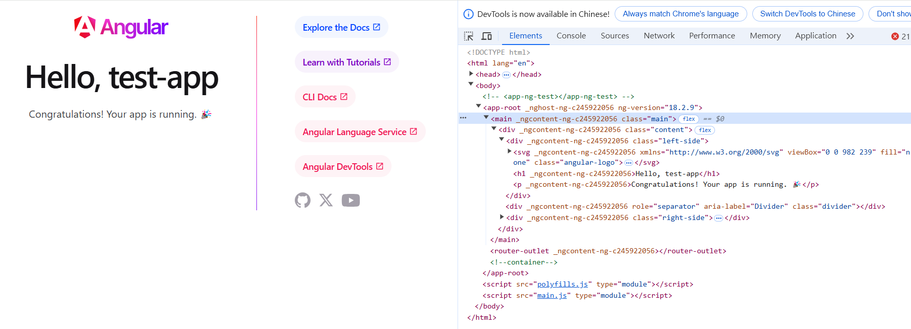

= angular.json & 啟動流程

== project配置

`angular.json` 中的 `projects` 配置項包含應用程序的具體配置。以 `test-app` 為例：

[source,json]
----
project{
    "test-app": {
        "projectType": "application",
        "schematics": {},
        "root": "",
        "sourceRoot": "src",
        "prefix": "app",
        "architect": { ... }
    }
}
----

- `projectType`: 項目類型，`application` 表示這是一個應用程式。
- `root`: 專案的根目錄。
- `sourceRoot`: 源碼文件的根目錄，這裡為 `src`。
- `prefix`: 元素選擇器前綴，這裡設置為 `app`。

== architect 設定

`architect` 包含不同的建置任務，包括 `build`、`serve`、`test` 等。

=== build
負責應用的構建，包含以下選項：

[source,json]
----
"build": {
    "builder": "@angular-devkit/build-angular:application",
    "options": {
        "outputPath": "dist/test-app",
        "index": "src/index.html",
        "browser": "src/main.ts",
        "polyfills": ["zone.js"],
        "tsConfig": "tsconfig.app.json",
        "assets": [
          { "glob": "**/*", "input": "public" }
        ],
        "styles": ["src/styles.css"],
        "scripts": []
    },
    "configurations": { 
        "production": {
            "budgets": [
              {
                "type": "initial",
                "maximumWarning": "500kB",
                "maximumError": "1MB"
              },
              {
                "type": "anyComponentStyle",
                "maximumWarning": "2kB",
                "maximumError": "4kB"
              }
            ],
            "outputHashing": "all"
        },
        "development": {
          "optimization": false,
          "extractLicenses": false,
          "sourceMap": true
        }
     }
}
----

- `builder`: 指定構建器。這裡使用 `@angular-devkit/build-angular:application`。 https://www.npmjs.com/package/@angular-devkit/build-angular?activeTab=readme[建構器選擇]
- `options`: 設置構建過程中的選項，包括 `outputPath`、`index`、`browser`、`polyfills` 等。
  - `outputPath: 構建輸出的目錄，預設為 `dist/test-app`。
  - `index`: 應用的入口 HTML 文件。
  - `browser`: 應用主入口 TypeScript 文件。
  - `polyfills`: Polyfill 文件配置。
  - `tsConfig`: 構建時的 TypeScript 配置。
  - `assets`: 要包含的靜態資源。
  - `styles`: 主樣式文件。
  - `scripts`: 全域腳本配置。
  - `configurations`: 建構時的一些環境配置(預設是 development )

=== serve
負責應用的伺服器啟動配置。

[source,json]
----
"serve": {
    "builder": "@angular-devkit/build-angular:dev-server",
    "configurations": {
        "production": {
          "buildTarget": "test-app:build:production"
        },
        "development": {
          "buildTarget": "test-app:build:development"
        }
    },
    "defaultConfiguration": "development"
}
----

- `builder`: 指定開發伺服器建置器。
- `configurations`: 不同的伺服器配置環境，包含 `production` 和 `development`。

== Angular啟動流程

1. Angular CLI指令啟動伺服器
+
----
ng serve
----

2. Angular CLI會讀取 `angular.json` 的配置決定如何建構應用程式
+
----
"serve": {
    "builder": "@angular-devkit/build-angular:dev-server",
    ...
}
----
+
此建構會使用webpack編譯及打包ts，並使用web-dev-server啟動伺服器
3. 根據build所配置的執行入口點執行程式
+
----
"build": {
    ...
    "options": {
        ...
        "index": "src/index.html",
        "browser": "src/main.ts"
        ...
    },
    "configurations": { ... }
}
----
4. 在 `main.ts` 中將獨立元件作為起始載入
+
`src/main.ts`
+
[source,typescript]
----
import { bootstrapApplication } from '@angular/platform-browser';
import { appConfig } from './app/app.config';
import { AppComponent } from './app/app.component';

bootstrapApplication(AppComponent, appConfig);
----
+
`bootstrapApplication()` 方法用於啟動獨立元件作為應用程式的根元件
+
[source,typescript]
----
export declare function bootstrapApplication(
    rootComponent: Type<unknown>, 
    options?: ApplicationConfig): 
Promise<ApplicationRef>;
----

5. 在AppComponent中透過設定selector屬性讓html透過標籤來加入元件的內容，這個@Component裝飾器內設定了一個 templateUrl 屬性值為 './app.component.html'，表示此元件會以 ./app.component.html 當作樣板輸出至介面上
+
`app.component.ts`
+
[source,typescript]
----
import { Component } from '@angular/core';
import { RouterOutlet } from '@angular/router';
import { TestModuleModule } from '../test-module/test-module.module';

@Component({
  selector: 'app-root',
  standalone: true,
  imports: [RouterOutlet],
  templateUrl: './app.component.html',
  styleUrl: './app.component.css'
})
export class AppComponent {
  title = 'test-app';
}
----
6. 該元件樣板內容就會被加入到<app-root>標籤
+
[source,html]
----
<!doctype html>
<html lang="en">
<head>
  <meta charset="utf-8">
  <title>TestApp2</title>
  <base href="/">
  <meta name="viewport" content="width=device-width, initial-scale=1">
  <link rel="icon" type="image/x-icon" href="favicon.ico">
</head>
<body>
  <app-root></app-root>
</body>
</html>
----
+
此時<app-root>標籤就會替換成 `app.component.html` 的內容
+

== 流程總結
`ng serve` => `angular.json` => `webpack` => `index.html` => `main.ts` => `app.component.ts`

link:Directory_Structure.html[回上一頁]
