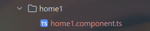
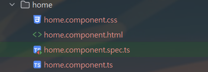
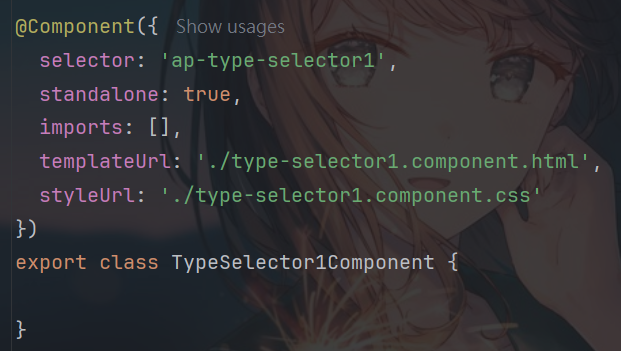

= ng generate components 僅生成.ts檔案

== 事情原由

在使用Angular18官網的Tutorials的範例檔案時，我在專案中下了 `ng generate component home1` 的指令要去產生home1的component資料夾與檔案。

指令完成後，開啟資料夾後發現生成的檔案與原本預期的不太相同。

.產生出來的檔案

原先是會預期產生以下幾個檔案

.預期結果

然而卻是只有一個，這又是為什麼呢?原因就出在Angular.json檔的設定當中。

== angular.json 檔案說明

`angular.json` 是 Angular 專案的設定檔，內容包括專案的建置(build)、測試(test)、伺服器(server)等的設定。這個檔案管理專案中的所有應用程式、庫和工具的工作流程。

=== 結構

`angular.json` 的主要結構包含: 

- **$schema**: 定義 JSON 結構的參考，讓工具能夠檢查檔案格式。
- **version**: Angular 配置檔案的版本號。
- **projects**: 包含專案的相關設定，每個專案都有獨立的配置。

=== 範例

.angular.json
[source,json]
----
{
  "$schema": "./node_modules/@angular/cli/lib/config/schema.json",
  "version": 1,
  "projects": {
    "my-app": {
      "projectType": "application",
      "schematics": {},
      "root": "",
      "sourceRoot": "src",
      "prefix": "app",
      "architect": {
        "build": {
          "builder": "@angular-devkit/build-angular:browser",
          "options": {
            "outputPath": "dist/my-app",
            "index": "src/index.html",
            "main": "src/main.ts",
            "polyfills": "src/polyfills.ts",
            "tsConfig": "tsconfig.app.json",
            "assets": [
              "src/favicon.ico",
              "src/assets"
            ],
            "styles": [
              "src/styles.css"
            ],
            "scripts": []
          }
        }
      }
    }
  }
}
----

=== 主要屬性

- **projects**: 定義專案及其對應的設定。
- **architect**: 包含 `build`、`test`、`serve` 等命令的配置。
- **options**: 配置每個指令的具體參數，例如輸出路徑、資產、樣式、腳本等。
- **schematics**: `schematics` 是一種用來產生程式碼和模組的工具，它能自動化許多開發過程，比如生成元件、模組、服務等。`schematics` 允許使用 Angular CLI 快速生成元件並將其自動集成到專案中。

=== 自訂屬性

可以修改 `angular.json` 的設定來自訂 Angular 專案的行為，例如我們可以在schematics內分別針對不同模組設定:

- **inlineTemplate**: 是否將模板嵌入到元件的 TypeScript 檔案中。
- **inlineStyle**: 是否將樣式嵌入到元件的 TypeScript 檔案中。
- **skipTests**: 是否跳過自動生成測試檔案。

經過以上的操作，當我們在使用 `ng generate component` 指令產生 component 時， Angular CLI 會去讀取此設定檔，若是讀到 `inlineTemplate` 與 `inlineStyle` 時便不會幫我們產生html跟css。

因為 Angular CLI 會假設我們將 HTML 與 CSS 分別寫到 `@Component`` 裝飾器下的 template 與 style 內。

== 額外補充 selector prefixs

Angular 團隊建議為專案內定義的所有自訂元件使用簡短、一致的前綴。這樣命名空間化選擇器可以立即明確某個元件的來源。

預設情況下，Angular CLI 使用 app-。

=== 如何設定

在Angular.json內的prefix中設定。

[source,json]
----
{
  "$schema": "./node_modules/@angular/cli/lib/config/schema.json",
  "version": 1,
  "projects": {
    "my-app": {
      "prefix": "ap", //<-此處設定
    }
  }
}
----

然後我們用 `ng generate component home1` 產生一個 `typeSelector1`` 的component，會發現到 Angular CLI 幫我們在selector的前綴加上了ap。

.效果

link:index.html[回首頁]

