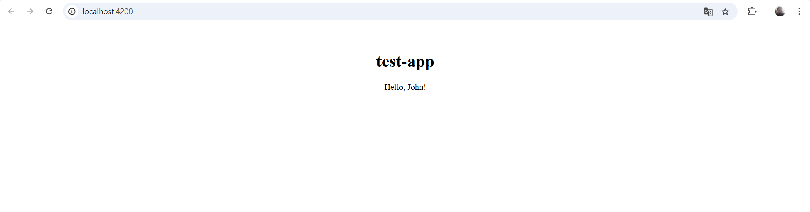
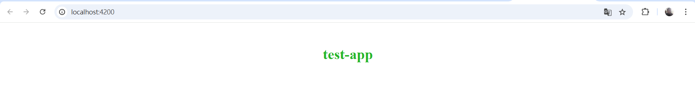
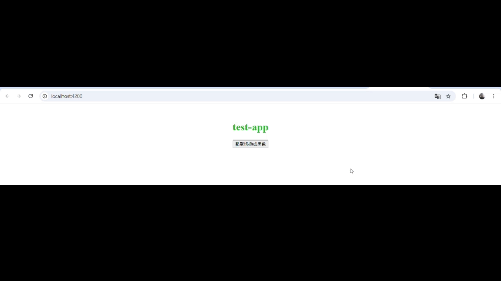
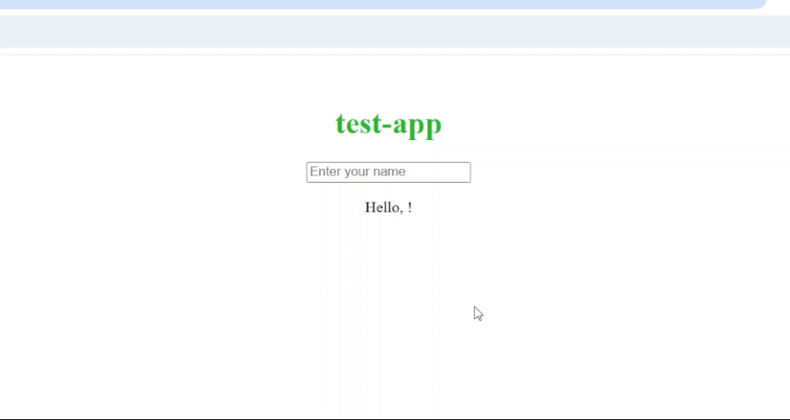
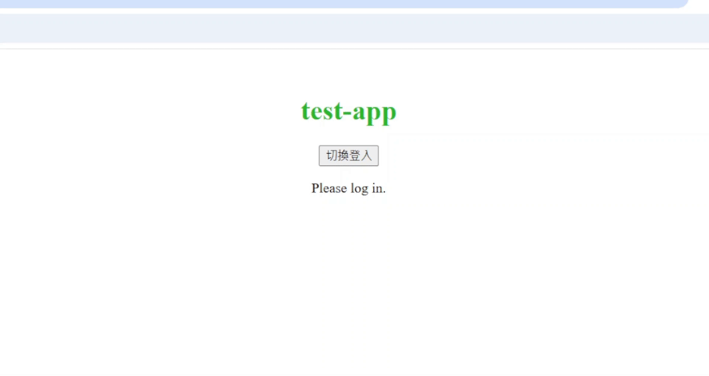
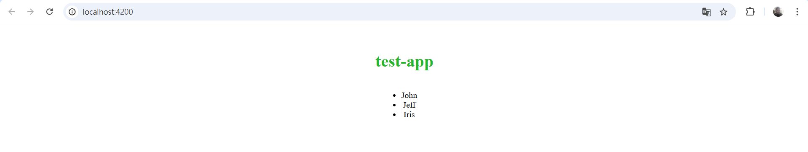

== Angular 專案結構

=== HTML模板 (Template)
Angular 組件的模板文件，負責定義類別組件的視圖結構，透過 Angular 的模板語法實現資料的顯示、條件渲染、事件處理等功能，並動態更新畫面，與 app.component.ts 當中的邏輯緊密結合，實現互動式的使用者界面。

==== HTML模板常用的語法

* **插值表達式 {{}}:** 用來顯示組件類中的資料
+
*app.component.ts*
+
[source,typescript]
----
import { Component } from '@angular/core';

@Component({
  selector: 'app-root',
  standalone: true,
  templateUrl: './app.component.html',
  styleUrl: './app.component.css'
})

export class AppComponent {
  title = 'test-app';
  userName = 'John';
}
----
+
*app.component.html*
+
[source,html]
----
<h1>{{ title }}</h1>  <!--  test-app   -->

Hello, {{ userName }}!
  <!--  Hello, John   -->
----
+

* **屬性綁定:** [property]="componentAttribute"
+
將組件中的資料綁定到HTML元素的屬性上，讓屬性值可以動態更新
+
*app.component.ts*
+
[source,typescript]
----
import { Component } from '@angular/core';

@Component({
  selector: 'app-root',
  standalone: true,
  templateUrl: './app.component.html',
  styleUrl: './app.component.css'
})

export class AppComponent {
  title = 'test-app';
  color = "color: #26b72a";
}

----
+
*app.component.html*
+
[source,html]
----
<h1 [style]="color">{{ title }}</h1>
----
+

* **事件綁定:**
+
當操作者觸發某個事件（點擊、鍵盤事件）時，綁定的函數會被調用
+
*app.component.ts*
+
[source,typescript]
----
import { Component } from '@angular/core';

@Component({
  selector: 'app-root',
  standalone: true,
  templateUrl: './app.component.html',
  styleUrl: './app.component.css'
})

export class AppComponent {
  title = 'test-app';
  color = "color: #26b72a";

  onClick() {
    this.color = "color: #000000";
  }
}
----
+
*app.component.html*
+
[source,html]
----
<h1 [style]="color">{{ title }}</h1>
<button (click)="onClick()">點擊切換成黑色</button>
----
+

* **雙向資料綁定:** [(ngModel)]="property"
+
雙向資料綁定允許模型與視圖之間的資料同步。當模型變更時，視圖自動更新，當使用者在視圖中修改時，模型也會自動變更
+
*app.component.ts*
+
[source,typescript]
----
import { Component } from '@angular/core';
import { FormsModule } from '@angular/forms'; // 需要import FormsModule

@Component({
  selector: 'app-root',
  standalone: true,
  imports: [FormsModule],
  templateUrl: './app.component.html',
  styleUrl: './app.component.css'
})

export class AppComponent {
  title = 'test-app';
  color = "color: #26b72a";

  userName = '';
}
----
+
*app.component.html*
+
[source,html]
----
<h1 [style]="color">{{ title }}</h1>
<input [(ngModel)]="userName" placeholder="Enter your name">

Hello, {{ userName }}!

----
+
上述程式當使用者在輸入框輸入內容時，網頁同時會動態更新userName屬性
+

* **條件渲染:** *ngIf
+
根據條件來顯示或隱藏 HTML 元素
+
*app.component.ts*
+
[source,typescript]
----
import { Component } from '@angular/core';
import { CommonModule } from '@angular/common'; // 需要import CommonModule

@Component({
  selector: 'app-root',
  standalone: true,
  imports: [CommonModule],
  templateUrl: './app.component.html',
  styleUrl: './app.component.css'
})

export class AppComponent {
  title = 'test-app';
  color = "color: #26b72a";

  isLoggedIn = false;
  userName = 'John';

  onClick() {
    if (this.isLoggedIn) {
      this.isLoggedIn = false
    } else {
      this.isLoggedIn = true
    }
  }
}
----
+
*app.component.html*
+
[source,html]
----
<h1 [style]="color">{{ title }}</h1>
<button (click)="onClick()">切換登入</button>

Welcome back, {{ userName }}!

Please log in.

----
+
或是使用 *@if* 語法也可實現條件渲染(Angular 17)
+
*app.component.html*
+
[source,typescript]
----
<h1 [style]="color">{{ title }}</h1>
<button (click)="onClick()">切換登入</button>

@if (isLoggedIn) {
  
Welcome back, {{ userName }}!

}

@if (!isLoggedIn) {
  
Please log in.

}
----
+
[quote]
____
使用@if語法不需要匯入`CommonModule`
____
+

* **迭代渲染:** *ngFor
+
用來來迭代一個陣列，並渲染每個項目
+
*app.component.ts*
+
[source,typescript]
----
import { Component } from '@angular/core';
import { CommonModule } from '@angular/common'; // 需要import CommonModule

@Component({
  selector: 'app-root',
  standalone: true,
  imports: [CommonModule],
  templateUrl: './app.component.html',
  styleUrl: './app.component.css'
})

export class AppComponent {
  title = 'test-app';
  color = "color: #26b72a";

  persons = ['John', 'Jeff', 'Iris'];
}
----
+
*app.component.html*
+
[source,html]
----
<h1 [style]="color">{{ title }}</h1>
<ul>
  <li *ngFor="let person of persons">{{ person }}</li>
</ul>
----
+
或是使用 *@for* 語法也可實現條件渲染
+
[source,html]
----
<h1 [style]="color">{{ title }}</h1>
<ul>
  @for (person of persons; track person) {
    <li>{{ person }}</li>
  }
</ul>
----
+
[quote]
____
使用@for語法不需要匯入`CommonModule`
____
+

=== CSS樣式 (Style)
在Angular中的樣式組件是用來為特定的組件設計樣式

==== :host & :host-context

. :host
+
    - :host是css裡的偽類，用來定義宿主元素(也就是index.html當中的<app-root>)的樣式
+   
*簡單範例:*
+
*css*
+
----
:host {
    display: block;
    margin: 10px;
    padding: 20px;
    background-color: lightblue;
}
----
+
*html*
+
----
<body>
  <app-root></app-root>
</body>
----
+
若selector屬性為app-root，上述的<app-root>標籤就會套用到:host的樣式

. host-context
+
- :host-context 選擇器用來根據組件的外部上下文環境來設置樣式，當組件的祖先元素（或父元素）滿足特定條件時，該選擇器可以應用樣式到組件本身或其內部元素
+
*簡單範例*: 當使用者選擇了黑暗模式，所有的元件都應該要改成黑色背景白色文字 
+
*css*
+
[source,css]
----
/* child.component.css */
:host-context(.dark-theme) {
  background-color: black;
  color: white;
}
----
+
*html*
+
[source,html]
----

  <app-child></app-child>

----
+
:host-context(.dark-theme) 會檢查 app-child 的父級元素或祖先元素是否有 .dark-theme 類，如果有則會應用這些樣式，將 app-child 的背景設置為黑色，文字顏色設置為白色

=== 類別 (Class)
類別裡面包含了元件的相關邏輯，例如資料處理、事件處理等。 +
類別會放在 `app.component.ts` 檔案裡，而 `app` 就是元件的名稱。 +
當建立一個元件時，他會帶有 `@Component()` 裝飾器，裡面會有檔案的路徑指向，告訴Angular要去哪裡找HTML模板和CSS樣式。 +
一個元件的基本寫法如下：

[source,typescript]
----
import { Component } from "@angular/core";

@Component({
    selector: "app-item",
    // 接下來的檔案路徑會指出其它檔案在什麼位置
    templateUrl: "./item.component.html",
    styleUrls: ["./item.component.css"],
})
export class ItemComponent {
    // 程式碼寫在這裡
}
----

這個元件被稱為 `ItemComponent`，他的選擇器是 `app-item` 。 +
選擇器就像是HTML的標籤，可以把他放到其他的模板裡。 +
當瀏覽器渲染到選擇器時，就會把這個元件的HTML模板和CSS樣式一起渲染出來。

Angular 的元件具備高度封裝性，讓專案結構看起來更直覺。 +
而 Angular 的元件也讓專案更易於做單元測試、讓程式碼更易於解讀。

==== Component 裝飾器

常見的屬性包括：

1. `templateUrl`: Angular 元件樣板檔案的 URL。如果提供了它，就不要再用 `template` 來提供行內樣板了。
2. `template`: Angular 元件的行內樣板。如果提供了它，就不要再用 `templateUrl` 提供樣板了。
3. `selector`: 元件的選擇器。
4. `providers`: 提供此元件的服務。
5. `imports`: 載入的其他元件或模組。
6. `standalone`: 若為 `true`，此元件為獨立元件，不依賴其他模組。
7. `encapsulation`: 設定樣式隔離的範圍。

==== Component類別簡單範例

- 定義屬性:

[source,typescript]
----
export class AppComponent {
  title = 'test-app';
}
----

定義了組件的屬性，在html中可使用{{ title }}來取得組件的屬性值

[source,html]
----

{{ title }}
  <!-- 在頁面上會輸出test-app -->
----

- 定義方法:

[source,typescript]
----
export class AppComponent {
  title = 'app-root';
  userName = 'John';
  isLoggedIn = false;

  // 變更使用者登入狀態
  toggleLoginStatus() {
    this.isLoggedIn = !this.isLoggedIn;
  }

  // 設定新的使用者名稱
  changeUserName(newName: string) {
    this.userName = newName;
  }
}
----

在HTML中綁定這些方法來實現按鈕點擊事件

[source,html]
----
<h1>{{ title }}</h1>

User: {{ userName }}

<button (click)="toggleLoginStatus()">
  {{ isLoggedIn ? 'Logout' : 'Login' }}
</button>
----

- 定義組件的生命週期:

[source,typescript]
----
export class AppComponent implements OnInit, OnDestroy {
  title = 'test-app';
  data: any;

  ngOnInit() {
    // 初始化，通常用來取得資料
    console.log('Component initialized');
    this.data = this.fetchData();
  }

  ngOnDestroy() {
    // 當組件銷毀時執行
    console.log('Component destroyed');
  }

  fetchData() {
    return { message: 'I love systex' };
  }
}
----

==== 元件的生命週期

當 Angular 實例化元件類別並渲染元件檢視及其子檢視時，元件實例的生命週期就開始了。生命週期一直伴隨著變更檢測，Angular 會檢查資料繫結屬性何時發生變化，並按需更新檢視和元件實例。當 Angular 銷毀元件實例並從 DOM 中移除它渲染的樣板時，生命週期就結束了。當 Angular 在執行過程中建立、更新和銷毀實例時，指令就有了類似的生命週期。

你的應用可以使用生命週期鉤子方法來觸發元件或指令生命週期中的關鍵事件，以初始化新實例，需要時啟動變更檢測，在變更檢測過程中回應更新，並在刪除實例之前進行清理。

你不必實現所有生命週期鉤子，只要實現你需要的那些就可以了。

===== Angular 元件的生命週期階段
當你的應用透過呼叫建構式函式來實例化一個元件或指令時，Angular 就會呼叫那個在該實例生命週期的適當位置實現了的那些鉤子方法。

Angular 會按以下順序呼叫並執行這些鉤子方法：

|===
| 鉤子方法 | 用途 | 時機
|  `ngOnChanges()` | 當 Angular 設定或重新設定資料繫結的輸入屬性時回應。該方法接受當前和上一屬性值的 SimpleChanges 物件。 +
**這發生得比較頻繁，所以你在這裡執行的任何操作都會顯著影響效能。** | 如果元件繫結過輸入屬性，那麼在 `ngOnInit()` 之前以及所繫結的一個或多個輸入屬性的值發生變化時都會呼叫。 +
**如果你的元件沒有輸入屬性，或者你使用它時沒有提供任何輸入屬性，那麼框架就不會呼叫 ngOnChanges()。**   
|  `ngOnInit()` | 在 Angular 第一次顯示資料繫結和設定指令/元件的輸入屬性之後，初始化指令/元件。 | 在第一輪 `ngOnChanges()` 完成之後呼叫，只調用一次。 +
**即使沒有呼叫過 `ngOnChanges()`，也仍然會呼叫 `ngOnInit()`（比如當樣板中沒有繫結任何輸入屬性時）。**
|  `ngDoCheck()` | 檢測並回應對元件的輸入屬性的變化。 | 在每次變更檢測運行之後呼叫，並在 `ngOnChanges()` 和 `ngOnInit()` 之後呼叫。
|  `ngAfterContentInit()` | 當 Angular 把外部內容投影進元件的View之後，呼叫它。 | 在第一次 `ngDoCheck()` 之後呼叫，只調用一次。
|  `ngAfterContentChecked()` | 每次 Angular 完成被投影元件的變更檢測之後，呼叫它。 | 在 `ngAfterContentInit()` 和每次 `ngDoCheck()` 之後呼叫。
|  `ngAfterViewInit()` | 當 Angular 初始化完元件的View及其子View之後，呼叫它。 | 在第一次 `ngAfterContentChecked()` 之後呼叫，只調用一次。
|  `ngAfterViewChecked()` | 每次 Angular 完成元件及其子View的變更檢測之後，呼叫它。 | 在 `ngAfterViewInit()` 和每次 `ngAfterContentChecked()` 之後呼叫。
|  `ngOnDestroy()` | 在 Angular 銷毀元件之前，清理。 | 在 Angular 銷毀指令/元件之前呼叫。
|=== 

==== Angular怎麼讓元件具備高度封裝性的?

. 元件的獨立性
+
    * 自包含的單位 +
    每個 Angular 元件都可以看作是一個獨立的實體。 +
    元件內部包含自己的模板（HTML）、樣式（CSS）和邏輯（TypeScript）。 +
    這樣，開發者可以獨立於其他元件進行開發，測試和調試。

    * 生命週期管理 +
    Angular 通過元件的生命週期鉤子，讓開發者能夠對元件在不同階段進行操作，如初始化、更新或銷毀。

. 使用 `@Input()` 和 `@Output()` 裝飾器
+
    * 數據傳遞 +
    元件之間的數據傳遞通過 `@Input()` 裝飾器進行。 +
    父元件可以將數據傳遞給子元件，使子元件可以根據這些數據渲染自己的視圖。 +
    這種方式使得元件的使用更加靈活，同時也強化了元件之間的隔離性。
+
[source,typescript]
----
    import { Component } from "@angular/core";

    @Component({
        selector: 'app-child',
        template: `
子元件數據: {{ data }}
`
    })
    export class ChildComponent {
        @Input() data: string;  // 從父元件接收數據
    }
----
+
    * 事件發射 +
    使用 `@Output()` 裝飾器，子元件可以發出事件，告知父元件發生了某個操作。 +
    這種事件驅動的交互方式使得父子元件之間的關係保持疏鬆。
+
[source,typescript]
----
    import { Component } from "@angular/core";

    @Component({
        selector: 'app-child',
        template: `<button (click)="notifyParent()">通知父元件</button>`
    })
    export class ChildComponent {
        @Output() notify: EventEmitter<void> = new EventEmitter();

        notifyParent() {
            this.notify.emit();  // 發射事件
        }
    }
----

. 模組化架構
+
    * NgModule +
    Angular 的模組化架構使用 `@NgModule` 裝飾器，這使得開發者可以將相關的元件、指令和管道組織在一起。 +
    例如，開發者可以創建一個 `SharedModule` ，其中包含多個可以重用的元件。
+
[source,typescript]
----
@NgModule({
    declarations: [ChildComponent, AnotherComponent],
    imports: [CommonModule],
    exports: [ChildComponent]
})
export class SharedModule {}
----
+
    * 功能性模組 +
    除了 `AppModule`，開發者可以根據功能創建多個模組，使得應用更具可維護性和擴展性。 +
    這樣，開發者可以在不同的模組之間隨意重用元件，進一步提高封裝性。

. 依賴注入
+
    * 服務與依賴管理 +
    Angular 的依賴注入機制允許服務和其他依賴的管理，使得元件不需要自行創建依賴，從而減少了耦合。 +
    例如，開發者可以將 API 調用封裝在服務中，然後將該服務注入到需要的元件中。
+
[source,typescript]
----
@Injectable({
    providedIn: 'root'
})
export class ApiService {
    // ...
}

@Component({
    selector: 'app-example',
    template: `...`
})
export class ExampleComponent {
    constructor(private apiService: ApiService) {}
}
----

. 封裝 CSS
+
    * 樣式隔離 +
    Angular 提供了樣式封裝功能，讓元件的樣式不會影響到其他元件的樣式。 +
    這是通過 Shadow DOM 或者 View Encapsulation 實現。 +
    開發者可以選擇不同的樣式封裝策略，確保元件的樣式只在其範圍內有效。
+
[source,typescript]
----
@Component({
    selector: 'app-child',
    templateUrl: './child.component.html',
    styleUrls: ['./child.component.css'],
    encapsulation: ViewEncapsulation.Emulated // 預設的樣式封裝模式
})
export class ChildComponent {}
----
+
    ** 補充: link:Shadow_DOM.html[Shadow DOM]
+
    ** 補充: link:View_Encapsulation.html[View Encapsulation]

link:index.html[回首頁]

== 建立一個新的元件

ng generate component item
該指令會建立以下內容：

用於 HTML 的 item.component.html
用於邏輯的 item.component.ts
用於樣式的 item.component.css
測試檔案 item.component.spec.ts
=== 手動建立元件

你也可以手動建立元件。方法如下：

建立一個新檔案 <component-name>.component.ts。
新增元件所需的 import 和 @Component 裝飾器。

[source, javascript]
----
import { Component } from '@angular/core';

@Component({
  selector: 'app-component-overview',
  templateUrl: './component-overview.component.html',
  styleUrls: ['./component-overview.component.css']
})
export class ComponentOverviewComponent {
  // 程式碼寫在這裡
}
----

=== 指定元件的 CSS 選擇器

每個元件都需要一個 CSS 選擇器，用來指示 Angular 在遇到對應標籤時，實例化元件。

[source, javascript]
----
@Component({
  selector: 'app-component-overview',
})
----
=== 定義一個元件的樣板

樣板是用來渲染元件的 HTML，可以透過 templateUrl 引用外部檔案，或直接使用 template 在元件中定義。

[source, javascript]
----
@Component({
  selector: 'app-component-overview',
  template: '<h1>Hello World!</h1>',
})
如果樣板跨多行，可以使用反引號（``）包起來：
----
[source, javascript]
----
@Component({
  selector: 'app-component-overview',
  template: `
    <h1>Hello World!</h1>
    
This template definition spans multiple lines...

  `
})
----

要把樣板定義為外部檔案，就要把 `templateUrl` 新增到 `@Component` 裝飾器中。

[source,javascript]
----
@Component({
  selector: 'app-component-overview',
  templateUrl: './component-overview.component.html',
})
----

要在元件中定義樣板，就要把一個 `template` 屬性新增到 `@Component` 中，該屬性的內容是要使用的 HTML。

[source,javascript]
----
@Component({
  selector: 'app-component-overview',
  template: '<h1>Hello World!</h1>',
})
----

如果你想讓樣板跨越多行，可以使用反引號（`）。比如：

[source,javascript]
----
@Component({
  selector: 'app-component-overview',
  template: `
    <h1>Hello World!</h1>
    
This template definition spans multiple lines.

  `
})
----

Angular 元件需要一個用 `template` 或 `templateUrl` 定義的樣板。但你不能在元件中同時擁有這兩個語句。

簡單來說: 每個元件都要設定一個 `template`，但有兩種方式：
- `template` 是一個直接寫在元件內的 HTML。
- `templateUrl` 是一個外部檔案的位址。

=== 宣告元件的樣式

如同上方設定樣板，你可以透過以下方式宣告樣式：

[source,javascript]
----
@Component({
  selector: 'app-component-overview',
  styleUrls: ['./component-overview.component.css']
})
----

若要設定多個樣式檔案，可以用陣列：

[source,javascript]
----
@Component({
  selector: 'app-component-overview',
  styleUrls: ['./styles1.css', './styles2.css']
})
----

= Angular其他實用範例

== Event handling

Angular 處理事件時，會將事件與組件實例綁定，與傳統 JavaScript 的事件處理不同。
this會指向該元件

== Change Detection

Change Detection 在以下情況下觸發：

1. 事件觸發。
2. 非同步操作完成。
3. 手動觸發 `ChangeDetectorRef.detectChanges()`。

== Component Communication

Angular 提供了 `@Input` 和 `@Output` 來處理元件之間的通訊。

=== @Input

[source,javascript]
----
@Component({
  selector: 'app-user',
  template: `
    
The user's occupation is {{ occupation }}

  `
})
export class UserComponent {
  @Input() occupation = '';
}
----

=== @Output
1.傳入事件

使用@Output建立父與子組件的溝通，並且把值assign給EventEmitter，
父層
[source,javascript]
----
//樣板
  
my name is {{myName}} 

<app-child (updateNameFun)="updateName($event)"></app-child>
//組件
  updateName(inputName:string){
     this.myName = inputName;
  }
----

子層
[source,javascript]
----
@Component({
  selector: 'app-child',
  styles: `.btn { padding: 5px; }`,
  template: `
   test
    <input type="text" (change)="addItem($event)" /> 
  `,
  standalone: true,
})
export class ChildComponent {
  @Output() updateNameFun = new EventEmitter<string>();//在angular中，this會幫指向組件，必須用$event才能指向觸發事件
  //當這個input觸發change事件後執行addItem並把觸發事件當作參數傳入，最後透過EventEmitter將事件發送回去再附加傳入值
  addItem(e:any) {
    this.updateNameFun.emit(e.target.value); 
  }
}
----

== Routing

=== 1.Create an app.routes.ts file

[source,javascript]
----
import { Routes } from '@angular/router';
import { HomeComponent } from './home/home.component';
import { UserComponent } from './user/user.component';

export const routes: Routes = [
  { path: '', component: HomeComponent },
  { path: 'user', component: UserComponent }
];
----

=== 2.Add routing to provider

[source,javascript]
----
import { provideRouter } from '@angular/router';
import { routes } from './app.routes';

export const appConfig: ApplicationConfig = {
  providers: [provideRouter(routes)]
};
----

=== 3.Import RouterOutlet in the component

[source,javascript]
----
@Component({
  selector: 'app-root',
  template: `
    <nav>
      <a routerLink="/">Home</a>
      |
      <a routerLink="/user">User</a>
    </nav>
    <router-outlet></router-outlet> 
  `
})
----

== Forms

你可以使用 `ReactiveFormsModule` 或 `FormsModule` 來處理表單的資料繫結和驗證。

== Reactive Forms

1.在 component 中定義這個表單擁有的屬性：

[source,javascript]
----
export class UserComponent {
  profileForm = new FormGroup({
    name: new FormControl(''),
    email: new FormControl(''),
  });

  getUser(){
    console.log(this.profileForm);
  }
}
----

2.在 template 中：

[source,html]
----

user page

my name is {{username}}

<form [formGroup]="profileForm">
  <label>
    Name
    <input type="text" formControlName="name" />
  </label>
  <label>
    Email
    <input type="email" formControlName="email" />
  </label>
  <button type="submit" (click)="getUser()">Submit</button>
</form>

// 要提交表單，則在 form 標籤上加上 (ngSubmit)="handleSubmit()"
----

== Import Validators

1.在 component 中匯入 Validators：
[source,javascript]
----
import { ReactiveFormsModule, Validators } from '@angular/forms';
----
2.增加表單驗證：
[source,javascript]
----
profileForm = new FormGroup({
  name: new FormControl('', Validators.required), //第二個參數開始增加驗證方式
  email: new FormControl('', [Validators.required, Validators.email]),
});
----
3.在template 中使用表單驗證：
[source,html]
----
<button type="submit" [disabled]="!profileForm.valid">Submit</button>
----

== Dependency Injection
Angular 可以在執行期間注入你要的 service 或 resource。

=== Creating an Injectable Service

在類別上標示 `@Injectable` 讓它可以被其他地方注入。

==== 參數
- `providedIn` -> (scope)

===== scope
- 'root' : 整個應用程式
- 'platform' :所有頁面上的應用程式共享一個特殊的單例平台注入器
- 'any' : 在每個延遲加載的模組中提供一個唯一的實例，而所有提前加載的模組則共享一個實例。This option is DEPRECATED。
- 'null' : 等同於undefined，不會自動注入在任何地方，你必須加入在providers陣列裡面，在 @NgModule 或 @Component、@Directive上

==== 範例

.Service

[source,javascript]
----
import { Injectable } from '@angular/core';

@Injectable({
  providedIn: 'root',  // 定義可以使用的範圍
})
export class CarService {
  cars = ['Sunflower GT', 'Flexus Sport', 'Sprout Mach One'];

  getCars(): string[] {
    return this.cars;
  }

  getCar(id: number) {
    return this.cars[id];
  }
}
----

.要注入資源的元件

[source,javascript]
----
import { Component, inject } from '@angular/core';
import { ChildComponent } from './child/child.component';
import { RouterOutlet, RouterLink } from '@angular/router';
import { ReactiveFormsModule } from '@angular/forms';
import { CarService } from './service/car.service';

@Component({
  selector: 'app-root',
  template: `
    <nav>
      <a routerLink="/">Home</a> |
      <a routerLink="/user">User</a>
       
      {{ mycars }}
    </nav>  
    <router-outlet />
  `,
  standalone: true,
  imports: [ChildComponent, RouterOutlet, RouterLink],
})
export class AppComponent {
  mycars = '';
  constructor(private carService: CarService) {
    this.mycars = this.carService.getCars().join(' ⭐️ ');
  } // 建構子注入

  items = new Array();
  handlerAddItem(item: string) {
    this.items.push(item);
  }
}
----

== Pipes

Pipes 是一個純函式，作用於 template (`{{}}`) 中，不會產生副作用。Angular 也提供一些內建的 pipe，下面是使用 Angular 提供的 pipe 和自定義 pipe 的範例。

自定義pipe
[source,javascript]
----
import {Pipe, PipeTransform} from '@angular/core';
@Pipe({
  standalone: true,
  name: 'star',
})
export class StarPipe implements PipeTransform {
  transform(value: string): string {
    return `⭐️ ${value} ⭐️`;
  }
}
----

使用pipe
[source,javascript]
----
import { Component, inject } from '@angular/core';
import { ChildComponent } from './child/child.component';
import { RouterOutlet, RouterLink } from '@angular/router';
import { ReactiveFormsModule } from '@angular/forms';
import { CarService } from './service/car.service';
import { DecimalPipe, DatePipe, CurrencyPipe } from '@angular/common'; //匯入
import { StarPipe } from './pipe/star.pipe';

@Component({
  selector: 'app-root',
  template: `
    <nav>
      <a routerLink="/">Home</a> |
      <a routerLink="/user">User</a>
       
      {{ mycars }}
    </nav> 
    <ul>
      <li>Number with "decimal" {{ num | number : '3.2-2' }}</li>
      <li>Date with "date" {{ birthday | date : 'medium' }}</li>
      <li>Currency with "currency" {{ cost | currency }}</li>
      <li>Custom Pipe with "star" {{ wrappedstring | star }}</li>
    </ul> 
    <router-outlet />
  `,
  standalone: true,
  imports: [ChildComponent, RouterOutlet, RouterLink, DecimalPipe, DatePipe, CurrencyPipe, StarPipe],
})
export class AppComponent {
  wrappedstring = 'come with stars';
  mycars = '';
  num = 103.1234;
  birthday = new Date(2023, 3, 2);
  cost = 4560.34;

  constructor(private carService: CarService) {
    this.mycars = this.carService.getCars().join(' ⭐️ ');
  }

  items = new Array();
  handlerAddItem(item: string) {
    this.items.push(item);
  }
}
----